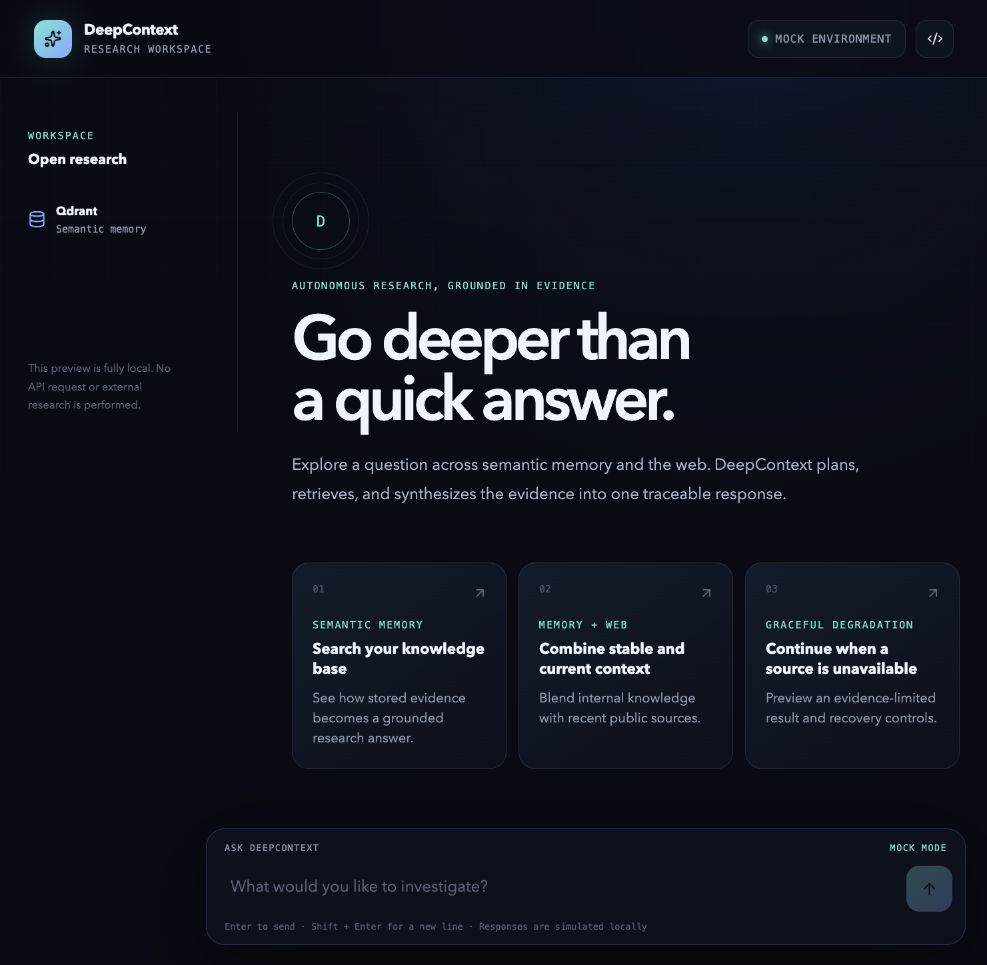
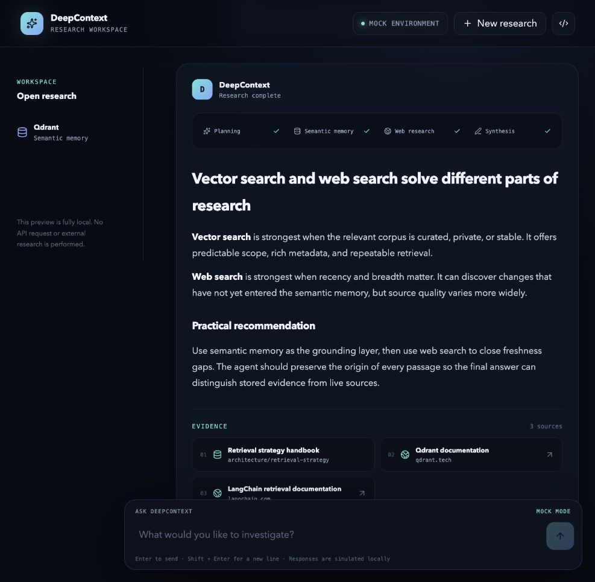
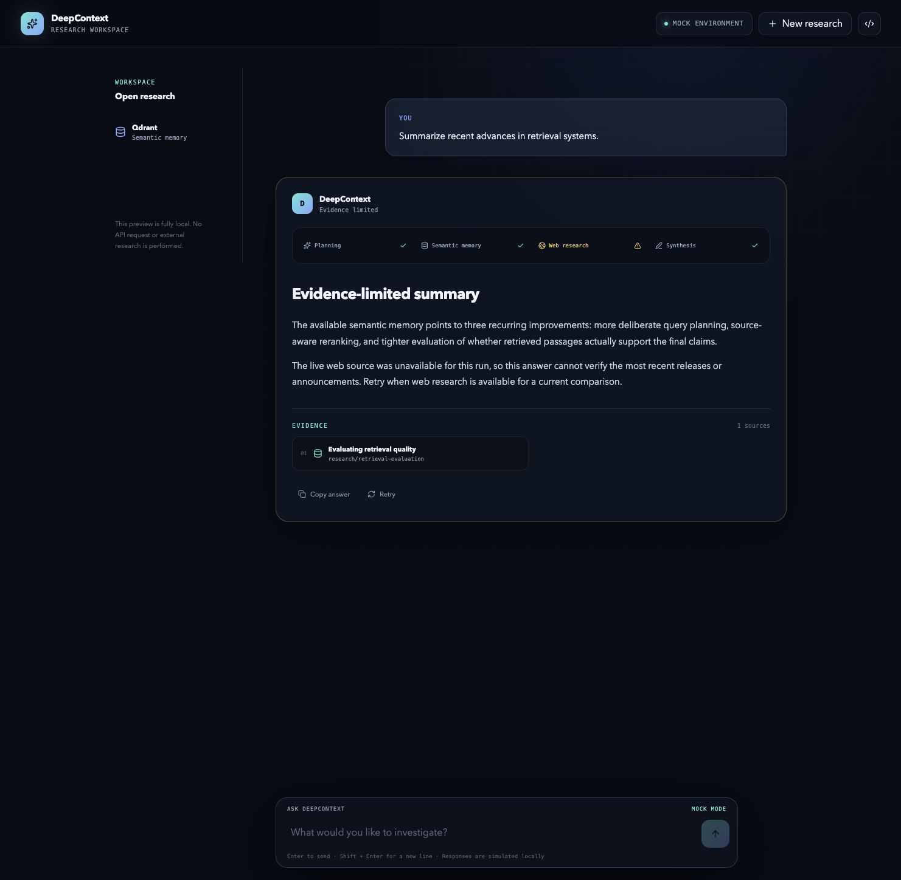
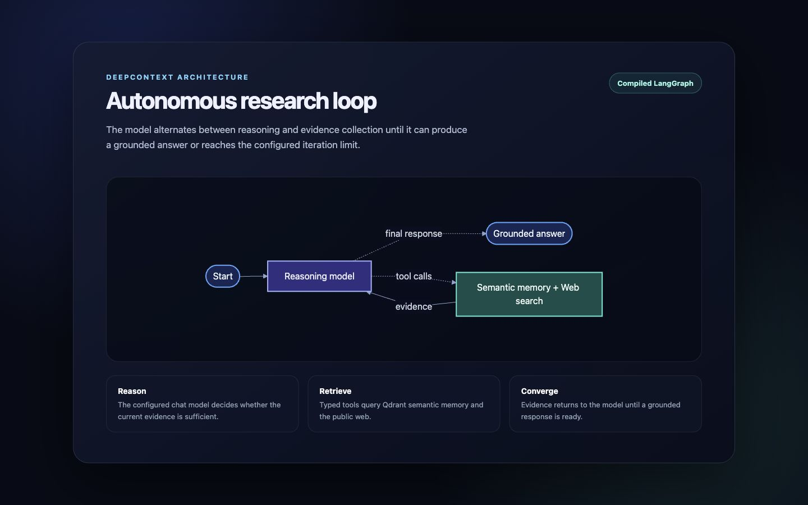

# DeepContext

DeepContext is an autonomous research agent with web search, Qdrant-powered semantic memory, tool calling, and multi-step reasoning.

It is intentionally domain-neutral. The agent generates an embedding only for the incoming query, searches an existing Qdrant collection, optionally searches the web, and synthesizes a grounded response with source metadata. It never creates collections, ingests documents, or mutates stored points.

## Research workspace



The mocked React workspace demonstrates the complete research experience without contacting the API: staged reasoning, streamed answers, normalized sources, cancellation, retries, failures, and partial results.

<table>
  <tr>
    <td width="50%">
      <strong>Grounded research</strong><br />
      Semantic memory and web evidence remain visible alongside the synthesized answer.
    </td>
    <td width="50%">
      <strong>Graceful degradation</strong><br />
      Usable evidence is preserved when a research source becomes unavailable.
    </td>
  </tr>
  <tr>
    <td></td>
    <td></td>
  </tr>
</table>

## Monorepo layout

```text
agent/       Python research-agent API
web/         React research chat
k8s/         Kubernetes baseline
compose.yaml local web, agent, and Qdrant stack
```

## Web chat

`web/` contains a React + Vite chat interface for the DeepContext research flow. The current UI is a self-contained mock: it simulates planning, semantic-memory retrieval, web research, token streaming, complete or partial results, errors, cancellation, retries, and source cards without making any network request.

```bash
cd web
npm install
npm run dev
```

Open `http://localhost:5173`. The mock transport is intentionally isolated behind `useResearchSession`, so it can later be replaced by the `/v1/research/stream` SSE endpoint without changing presentation components.

## How research works

1. A LangGraph workflow receives the question.
2. The configured LangChain embedding provider creates the query vector.
3. The agent searches a pre-populated Qdrant collection and can search the web.
4. The model decides whether more tool calls are needed, up to a bounded limit.
5. DeepContext returns a grounded answer and the sources it used.

The embedding model must match the model and vector dimension used to populate the collection.

## Qdrant collection contract

The collection must already exist. Dense vectors may use Qdrant's unnamed default vector or a named vector set through `DEEPCONTEXT_QDRANT_VECTOR_NAME`. Payload field names are configurable; defaults are:

```json
{
  "page_content": "Text supplied to the model",
  "source": "Human-readable source identifier",
  "source_id": "Stable identifier used for deduplication",
  "title": "Optional title",
  "url": "Optional URL"
}
```

DeepContext keeps at most two chunks from the same source by default.

## Local setup

Requires Python 3.11+ and [uv](https://docs.astral.sh/uv/).

```bash
cd agent
cp .env.example .env
uv sync
uv run uvicorn deepcontext.main:app --reload --port 8000
```

Set the API key required by the selected chat and embedding providers. Model identifiers use LangChain's `provider:model` format. `init_chat_model` and `init_embeddings` allow provider changes through configuration; install the matching LangChain integration package when selecting a provider not included by default.

## Docker Compose

```bash
cp agent/.env.example agent/.env
make up
```

The mock web interface is available at `http://localhost:3000`, the API at `http://localhost:8000`, and Qdrant at `http://localhost:6333`.

The root `Makefile` provides shortcuts for the complete stack and individual services:

```bash
make help      # list available commands
make up        # build and start the complete stack
make web       # start only the mocked web chat
make agent     # start the agent and its Qdrant dependency
make qdrant    # start only Qdrant
make logs      # follow logs from all services
make ps        # show service status
make down      # stop the stack
```

The first local Qdrant volume is empty. Populate it using external tooling, connect the agent to an external Qdrant URL, or reuse a pre-populated Docker volume:

```bash
QDRANT_VOLUME_NAME=my-existing-qdrant-volume make up
```

Data population and document embeddings deliberately live outside this repository. Web research can still operate while local semantic memory is empty.

## API

```bash
curl -X POST http://localhost:8000/v1/research \
  -H 'Content-Type: application/json' \
  -d '{"query":"Compare the main approaches to retrieval-augmented generation."}'
```

Use `POST /v1/research/stream` with the same body for server-sent events. `thread_id` is optional correlation metadata; conversation state is not persisted.

- `GET /health` reports process health.
- `GET /ready` reports semantic-memory and web-search availability.
- OpenAPI documentation is available at `/docs`.

## Observability

Set `OTEL_EXPORTER_OTLP_ENDPOINT` to export OpenTelemetry traces, metrics, and logs. Leave it empty or set `OTEL_SDK_DISABLED=true` to run without telemetry export. Langfuse uses its standard environment variables and remains optional.

## Tests and quality checks

```bash
cd agent
uv run pytest
uv run ruff check deepcontext tests
uv run ruff format --check deepcontext tests
uv run mypy deepcontext
```

## Kubernetes

The manifests deploy only the agent API. Create the referenced `deepcontext-agent-env` Secret with model, Qdrant, web-search, and optional observability configuration, update the placeholder image, then apply:

```bash
kubectl apply -k k8s
```

Qdrant is externally managed in the Kubernetes baseline.

## Implementation details

### Conversational flow with LangGraph

The research loop is implemented as a compiled LangGraph `StateGraph`. Its state carries the message history for the current request, the number of completed reasoning iterations, normalized source metadata, and a flag indicating whether a dependency failed partially.

The `assistant` node invokes the configured chat model with the research instructions and tool definitions. When the model returns tool calls, conditional routing sends execution to the `tools` node. Tool results are appended as `ToolMessage` instances and control returns to `assistant`, allowing the model to inspect evidence, refine its search, and decide whether another retrieval step is necessary. The workflow stops when the model produces a final response or reaches `DEEPCONTEXT_MAX_ITERATIONS`.

`thread_id` is used only for correlation in API events and telemetry. DeepContext does not persist conversations or require a checkpoint database.

### Semantic memory with Qdrant

Qdrant is a read-only vector database from the agent's perspective. For every semantic-memory tool call, DeepContext:

1. Prepares the query according to model conventions, including the E5 `query:` prefix when required.
2. Creates the query vector with LangChain's multi-provider `init_embeddings` interface.
3. Calls `AsyncQdrantClient.query_points` against the configured existing collection.
4. Applies the configured score threshold and candidate limit.
5. Normalizes payload fields and limits repeated chunks from the same source.
6. Returns the selected evidence to the LangGraph workflow as a tool result.

The embedding provider and model are configurable independently from the chat model. The query embedding must have the same dimension and semantic space as the document vectors already stored in Qdrant.

### Web search and tool calling

Web search is exposed to the model as a typed LangChain tool alongside semantic memory. The current adapter uses OpenRouter's web plugin and converts URL annotations into the same source structure used by Qdrant results. This gives the workflow one consistent representation for citations regardless of where the evidence came from.

Tool failures are returned to the model as structured observations. The workflow can continue with the remaining capability and marks the final result as `partial` when appropriate. If no usable evidence is collected, the API returns a `503 research_sources_unavailable` error instead of an ungrounded answer.

### Observability

OpenTelemetry instrumentation is optional and activated when `OTEL_EXPORTER_OTLP_ENDPOINT` is configured. It exports FastAPI traces, metrics, and application logs through OTLP. Langfuse callbacks are attached to LangGraph executions when `LANGFUSE_PUBLIC_KEY` and `LANGFUSE_SECRET_KEY` are present, providing visibility into model calls, tool calls, latency, and the full reasoning run without making observability a startup dependency.

### HTTP and streaming

FastAPI exposes synchronous and SSE research endpoints. Both use the same compiled workflow and response contracts. The streaming endpoint emits `metadata`, `token`, and one terminal `result` or `error` event. Shared Qdrant and HTTP clients are created during application lifespan and closed cleanly at shutdown.

## LangGraph workflow

The graph structure is generated from the compiled workflow with `workflow.graph.get_graph().draw_mermaid()`. The resulting Mermaid definition is rendered by the accompanying [HTML view](docs/langgraph-workflow.html) and captured as the image below.


